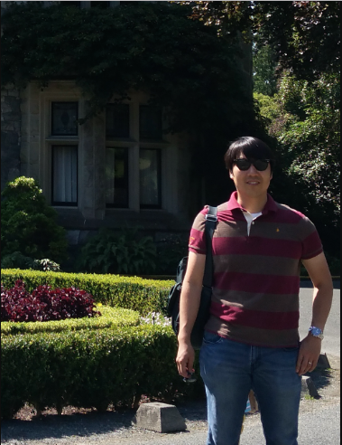

I'm currently a Postdoctoral Researcher at University of Tampa.  I was a Postdoctoral Researcher at Herzberg Astronomy and Astrophysics Research Centre, Victoria, BC, Canada from September 2018 to August 2019, and was also a Postdoctoral Researcher at the Department of Astronomy/[Kavli Insititute for Astronomy and Astrophysics](http://kiaa.pku.edu.cn/) at Peking University in Beijing, China from October 2014 to August 2018. In August 2014, I received my Ph.D. in Astronomy from [Seoul National University](http://astro.snu.ac.kr/).  
  
I have investigated formation and evolution of nearby galaxies through their star clusters. I studied nearby starburst galaxies for my Ph.D. thesis, and now I'm studing nearby early-type galaxies including Ultra-Diffuse galaxies using their globular clusters. 

### Contact Information

Email: sslim00 at gmail.com

Address: 401 W. Kennedy BLVD, Tampa, FL, USA 33606

Office: FO 101

### Academic Positions

* Sep. 2019 -          : Postdoc, University of Tampa, USA

* Sep. 2018 - Aug. 2019: Postdoc, Herzberg Astronomy and Astrophysics Research Centre, Canada

* Oct. 2014 - Aug. 2018: Postdoc, Peking University, China

### Education

* Aug. 2014: Ph.D. in Astronomy, Seoul National University, Korea

* Aug. 2008: M.S. in Astronomy, Seoul National University, Korea

* Aug. 2006: B.S. in Astronomy, Seoul National University, Korea

